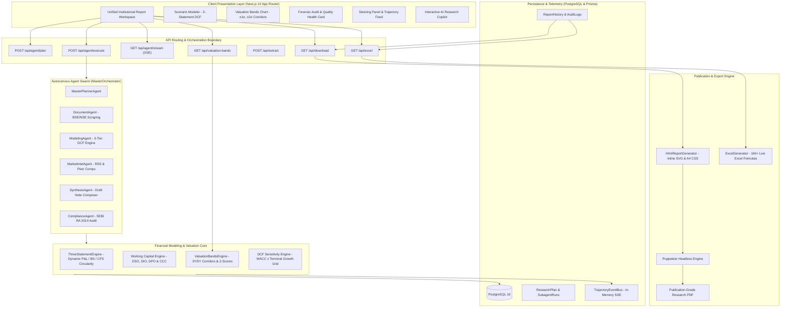
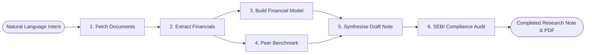
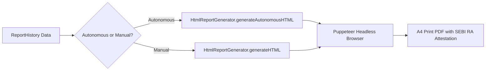

# 🏗️ EquiGen System Architecture & Technical Specifications

This document details the architectural layout, dual-mode pipeline, multi-agent autonomous swarm, data integrity safeguards, real-time SSE telemetry, and publication engine inside EquiGen.

---

## 🏛️ High-Level System Architecture

EquiGen operates as a modern hybrid AI equity research platform with two complementary execution engines:
1. **Autonomous AI Research Analyst** (`/api/agent/*`): An end-to-end multi-agent swarm that decomposes high-level investment intents into ordered research milestones, fetches live exchange disclosures, builds DCF valuation models, conducts regulatory compliance checks, and synthesizes publication-grade research notes.
2. **Assisted Document Processing Pipeline** (`/api/extract/*`): A sequential document-ingestion pipeline designed to extract, audit, and structure uploaded annual reports, DRHPs, and financial statements.



---

## 🤖 Mode 1: Autonomous Multi-Agent Research Swarm

The Autonomous Research mode is governed by the `MasterOrchestrator` and a directed acyclic execution graph (DAG) consisting of 6 specialized milestones:



### 1. MasterPlannerAgent (`src/lib/ai/planner/master-planner.ts`)
* **Role**: Translates natural-language investment intents (e.g. *"Initiation of coverage on Eternal Limited — 5-year DCF, compare margins vs M&M"*) into a structured execution plan (`ResearchPlanRecord`).
* **Milestone Decomposition**: Dynamically provisions 6 typed execution milestones (`FetchDocumentsMilestone`, `ExtractFinancialsMilestone`, `BuildFinancialModelMilestone`, `PeerBenchmarkMilestone`, `SynthesiseMilestone`, `ComplianceAuditMilestone`).
* **Peer Extraction**: Performs LLM-assisted entity and peer extraction to identify benchmark candidates from the prompt.
* **Latency & Cost Estimation**: Computes aggregate estimates based on the configured research depth (`quick`, `standard`, `deep`).
* **Persistence**: Inserts the pending plan into the `ResearchPlan` database table linked to the active `ResearchSession`.

### 2. DocumentAgent (`src/lib/ai/subagents/document-agent.ts`)
* **Live Exchange Scraping**: Scrapes official corporate disclosure archives from **BSE India** and **NSE India**.
* **Filing Classification**: Categorizes filings into annual reports, quarterly results, investor presentations, concall transcripts, and DRHP filings.
* **Credit Rating Intelligence**: Uses `credit-rating-tool.ts` to inspect exchange filings for credit rating agency actions (CRISIL, ICRA, CARE). Never fabricates ratings; if no filings are found, returns an empty rating profile.
* **Earnings Concall Transcripts**: Parses management commentary, capacity guidance, and margin outlook.

### 3. ModelingAgent (`src/lib/ai/subagents/modeling-agent.ts`)
* **3-Tier Data Architecture**:
  1. **Tier 1 (Audited Filings)**: Uses parsed financial statements from `DocumentAgent`.
  2. **Tier 2 (Live Screener Scraper)**: Scrapes public Screener.in corporate metrics (Sales, Operating Profit, OPM %, Net Profit, EPS) if filing extraction lacks depth.
  3. **Tier 3 (Explicit Fallback Baseline)**: If real filings and scrapers fail due to network restrictions or new listings, uses conservative baseline financial constants and sets `isDerivedFromRealData: false`.
* **Quantitative Valuation Engine**:
  - 5-year forward projections (Revenue, EBITDA, Operating Margin, PAT, Adjusted EPS).
  - WACC calculation based on capital structure, cost of debt, and equity beta.
  - Multi-scenario DCF valuation: **Base Case**, **Bull Case** (+15% revenue CAGR, +100bps margin expansion), and **Bear Case** (-10% volume compression).
  - Terminal value sensitivity grid across terminal growth rates (4.0% – 6.0%) and WACC (11.0% – 14.0%).

### 4. MarketIntelAgent (`src/lib/ai/subagents/market-intel-agent.ts`)
* **Real News & Industry Feeds**: Uses `sector-news-deep-tool.ts` to scrape live **Google News RSS** and **The Economic Times RSS** targeted specifically to the company and its sector.
* **Peer Valuation Benchmarking**: Compares trading multiples (P/E, EV/EBITDA, P/B, Market Cap) against direct domestic and global competitors.

### 5. SynthesisAgent (`src/lib/ai/subagents/synthesis-agent.ts`)
* **Living Draft Construction**: Merges findings into 7 standardized institutional report sections:
  1. `executive_summary`: Investment thesis, target price rationale, and catalyst summary.
  2. `business_description`: Business model breakdown incorporating real filing titles and segment revenue contributions.
  3. `financial_analysis`: Operating performance, margin trajectory, and balance sheet health.
  4. `valuation`: Detailed DCF valuation scenarios and peer multiple benchmarking.
  5. `key_risks`: Downside risks, raw material exposure, and regulatory headwinds.
  6. `management_qa_highlights`: Direct quotes and guidance from earnings concall transcripts.
  7. `disclosures`: Mandatory statutory disclosures under SEBI Research Analyst regulations.
* **Data Source Tracking**: Emits a `DataSourceSummary` indicating which sections are backed by live exchange filings vs fallback models.

### 6. ComplianceAgent (`src/lib/ai/subagents/compliance-agent.ts`)
* **SEBI (Research Analysts) Regulations, 2014 Audit**: Verifies that statutory warnings, risk disclaimers, and analyst certifications are present.
* **Mathematical Validation**: Checks that valuation multiples, target prices, and historical margins are internally consistent.
* **Conflict of Interest**: Audits disclosures for financial interest, compensation, or market-making activity in the target security.

---

## 📊 Mode 2: Integrated 3-Statement Engine & Live-Formula Excel Modeling

EquiGen incorporates a professional-grade circular 3-statement financial engine ([three-statement-engine.ts](file:///d:/13.my-startups/EquiGen/src/lib/financial-modeling/three-statement-engine.ts)) that bridges qualitative research and rigorous quantitative valuation.

```mermaid
flowchart TD
    subgraph IncomeStatement ["1. Income Statement (P&L)"]
        REV[Revenue: P x Q Build] --> EBITDA[EBITDA & Margins]
        EBITDA --> DAE[Depreciation & Amortization]
        DAE --> EBIT[EBIT / Operating Profit]
        EBIT --> INT[Net Interest Expense]
        INT --> EBT[Profit Before Tax]
        EBT --> TAX[Corporate Tax]
        TAX --> PAT[Net Profit / PAT]
    end

    subgraph BalanceSheet ["2. Balance Sheet (BS)"]
        WC_SCHED[Working Capital Schedule: DSO, DIO, DPO]
        CAPEX_SCHED[Fixed Asset Schedule: Capex -> Gross Block]
        DEBT_LOOP[Debt Schedule & Revolver Feedback]
        CASH_BAL[Ending Cash & Equivalents]
        BS_CHECK[Check: Assets = Liabilities + Equity (Δ = ₹0.00)]
    end

    subgraph CashFlow ["3. Cash Flow Statement (CFS)"]
        CFO[Cash Flow from Operations: PAT + NonCash - ΔNWC]
        CFI[Cash Flow from Investing: -Capex]
        CFF[Cash Flow from Financing: -Debt Repayment - Dividends]
        NET_CASH[Net Change in Cash: CFO + CFI + CFF]
    end

    PAT --> CFO
    DAE --> CFO
    WC_SCHED -->|Δ Working Capital| CFO
    CAPEX_SCHED -->|Capex & D&A| DAE & CFI
    NET_CASH --> CASH_BAL
    DEBT_LOOP --> INT & CFF
    CASH_BAL --> BS_CHECK
```

### Key Capabilities of the 3-Statement Engine
1. **Dynamic Statement Circularity**:
   - P&L Net Income feeds Operating Cash Flow.
   - Non-cash Depreciation & Amortization flows from the Capex/Fixed Asset schedule into both P&L and Cash Flow.
   - Net Working Capital changes ($\Delta \text{NWC}$) derived from DSO, DIO, and DPO directly adjust operating cash flow.
   - Ending cash on the Cash Flow statement updates the Balance Sheet cash line item, verifying total assets equal total liabilities and equity with **$\Delta = \text{₹0.00}$ balance sheet discrepancy**.
2. **Operational Working Capital Schedule**:
   - Receivables governed by **Days Sales Outstanding (DSO)**: $\text{Receivables} = (\text{Revenue} \times \text{DSO}) / 365$.
   - Inventory governed by **Days Inventory Outstanding (DIO)**: $\text{Inventory} = (\text{COGS} \times \text{DIO}) / 365$.
   - Payables governed by **Days Payable Outstanding (DPO)**: $\text{Payables} = (\text{Operating Expenses} \times \text{DPO}) / 365$.
   - Live **Cash Conversion Cycle (CCC)** metric: $\text{CCC} = \text{DSO} + \text{DIO} - \text{DPO}$.
3. **Institutional Excel Export with 160+ Live Formulas** (`src/lib/excel/excel-generator.ts`):
   - Rather than static numeric dumps, the `.xlsx` export generates active calculation trees with Excel formulas (`=SUM()`, `=EBITDA-Capex-ΔWC`, `=PV()`, `=NPV()`).
   - Analysts can modify operational driver assumptions in Microsoft Excel or Google Sheets, and all financial statements and DCF fair values recalculate instantaneously.

---

## 📈 Mode 3: Historical Valuation Multiples Bands Engine (P/E & EV/EBITDA)

EquiGen provides cyclical valuation context by charting current multiples against 3-year and 5-year statistical corridors ([valuation-bands-engine.ts](file:///d:/13.my-startups/EquiGen/src/lib/financial-modeling/valuation-bands-engine.ts)).

### 1. Statistical Standard Deviation Corridors
For any NSE/BSE listed company, the engine fetches monthly price history and aligns it with TTM fundamental metrics (EPS and EBITDA per share), deriving historical multiples ($M_t$):
- **Sample Mean ($\mu$)**: $\mu = \frac{1}{N}\sum_{t=1}^N M_t$
- **Sample Standard Deviation ($\sigma$)**: $\sigma = \sqrt{\frac{1}{N-1}\sum_{t=1}^N (M_t - \mu)^2}$
- **Valuation Corridors**: $+2\sigma$, $+1\sigma$, $\text{Mean}$, $-1\sigma$, $-2\sigma$.
- **Implied Price Corridors**: $\text{Price Band}(k\sigma, t) = (\mu + k\cdot\sigma) \times \text{Metric}_t$.

### 2. Statistical Regime Classification & Z-Scores
The engine calculates the current multiple's Z-Score ($Z = (M_{\text{current}} - \mu) / \sigma$) and classifies the valuation regime:
| Z-Score Range | Valuation Regime | Institutional Significance |
| :--- | :--- | :--- |
| $Z \ge +2.0\sigma$ | **Extreme Cyclical Peak (+2σ)** | Severe multiple compression risk; historical cycle top. |
| $+1.0\sigma \le Z < +2.0\sigma$ | **Elevated (+1σ to +2σ)** | Requires aggressive earnings delivery; multiple expansion capped. |
| $-1.0\sigma \le Z \le +1.0\sigma$ | **Fair Value Corridor (±1σ)** | Balanced risk-reward; stock compounds with earnings/FCF. |
| $-2.0\sigma \le Z < -1.0\sigma$ | **Discounted (-1σ to -2σ)** | Attractive discount corridor with margin of safety. |
| $Z < -2.0\sigma$ | **Deep Value / Cyclical Trough (-2σ)** | Extreme undervaluation; asymmetric contrarian entry for cyclicals. |

### 3. Empirical Mean-Reversion Alpha Tracking
The engine analyzes historical touchpoints where the stock reached extreme bands ($\ge +2\sigma$ or $\le -2\sigma$) and tracks the subsequent 12-month forward return, providing institutional committees with empirical mean-reversion probabilities.

---

## 🏢 Mode 4: Unified Institutional Workspace & Presentation Layer

Rather than splitting research across fragmented, persona-gated screens, EquiGen adopts a **Unified Institutional Workspace** ([UnifiedReportView.tsx](file:///d:/13.my-startups/EquiGen/src/components/dashboard/views/UnifiedReportView.tsx)):

1. **Investment Committee (IC) Memo & Variant Perception**:
   - 1-click clipboard-exportable IC memorandum containing rating, target price, CMP, upside, downside protection, quality score, and scenario targets.
   - Explicit contrast between **Market Consensus Expectation** and **EquiGen Variant Perception (Contrarian View)**.
2. **Interactive 3-Statement DCF Modeler** ([ScenarioModeler.tsx](file:///d:/13.my-startups/EquiGen/src/components/dashboard/shared/ScenarioModeler.tsx)):
   - Unified KPI header strip with formatted Indian numbers (`formatCrores`).
   - Fast scenario presets: Consensus Base, Bull (+16% Rev), Bear (7% Rev), and Working Capital Stress (+30d DSO).
   - Sub-tabbed views: *Model Drivers & Working Capital*, *5Y Projected Statements*, and *Valuation Sensitivity Grid*.
3. **Interactive Valuation Bands Chart** ([ValuationBandsChart.tsx](file:///d:/13.my-startups/EquiGen/src/components/dashboard/shared/ValuationBandsChart.tsx)):
   - Interactive SVG charting of stock prices against $\pm 1\sigma, \pm 2\sigma$ corridors.
   - Switchers for P/E vs EV/EBITDA, 3Y vs 5Y horizons, and Price (₹) vs Multiples (x).
4. **Forensic Accounting & Quality Audit** ([ForensicAuditCard.tsx](file:///d:/13.my-startups/EquiGen/src/components/dashboard/shared/ForensicAuditCard.tsx)):
   - Overall Quality Health Score (0-100) and Risk Classification (LOW / MODERATE / HIGH).
   - Cash Flow Quality (CFO/PAT ratio and CFO-PAT divergence).
   - Earnings Manipulation Risk (Beneish M-Score 8-variable model).
   - Bankruptcy & Solvency Risk (Altman Z-Score safe/grey/distress zones).
   - Governance & Capital Allocation Audit (Promoter pledging, contingent liabilities vs net worth, audit qualification flags).
5. **Regulatory Certification & SEBI RA Sign-Off** ([SignoffModal.tsx](file:///d:/13.my-startups/EquiGen/src/components/dashboard/SignoffModal.tsx)):
   - Reviewer identity stamping, SEBI registration number validation (`INH...`), and cryptographic audit trail.

---

## 📡 Real-Time Telemetry & Steering Architecture

### SSE Trajectory Stream (`src/app/api/agent/stream/route.ts`)
The orchestrator publishes lifecycle events to an in-memory `TrajectoryEventBus`, streamed to the frontend via Server-Sent Events (SSE):

| Event Name | Description |
| :--- | :--- |
| `plan_created` | Master planner generated the execution graph. |
| `milestone_started` | An execution milestone transitioned to running state. |
| `subagent_start` | A specialized subagent was dispatched. |
| `tool_call` | An external tool (web scraper, RSS feed, filing parser) was invoked. |
| `draft_updated` | A research section was generated/updated in real time. |
| `steering_applied` | Analyst guidance or milestone adjustment took effect. |
| `plan_complete` | All 6 milestones finished; report persisted to database. |
| `plan_failed` | Execution aborted due to quota or network failure. |

### Analyst Steering Panel (`src/components/SteeringPanel.tsx`)
* **Human-in-the-Loop Interventions**: Certified analysts can pause execution, modify valuation assumptions (e.g. adjust WACC, terminal growth rate), skip milestones, or abort execution.
* **Real-Time Step Synchronization**: Progress bar tracks execution milestones directly (Step 1 of 6: 17% → Step 6 of 6: 100%).

---

## 📄 Publication Engine: Print-Ready HTML & PDF Generation

EquiGen utilizes a two-stage rendering pipeline for generating research PDFs:



1. **`HtmlReportGenerator` (`src/lib/ai/html-report-generator.ts`)**:
   - Compiles markdown tables, bullet lists, blockquotes, and inline financial metrics into print-optimized A4 HTML.
   - Embeds inline SVG financial charts without external runtime charting dependencies.
   - Enforces strict CSS page break rules (`@page { size: A4 portrait; margin: 0; }`, `.page { page-break-after: always; }`).
2. **`PDFGenerationService` (`src/lib/pdf/index.ts`)**:
   - Launches headless Puppeteer with Chrome print parameters (`printBackground: true`, zero margins).
   - Injects the SEBI RA certification block, reviewer credentials, and statutory disclaimer.
   - Caches the compiled base64 PDF directly in the `ReportHistory.pdfBase64` column for instant subsequent downloads.

---

## 🛡️ Data Integrity & Transparency Safeguards

To prevent hallucinated data in financial research, EquiGen implements strict data provenance rules:

1. **Terminal Data Quality Report**:
   At the conclusion of each autonomous pipeline execution, the `MasterOrchestrator` logs a structured terminal summary:
   ```
   ================================================================================
   [MasterOrchestrator] ═══ DATA QUALITY REPORT: Eternal Limited (ETERNAL) ═══
     Total Latency : 48.2s
     Data Quality  : 5/6 sources live
     Model Fallback: NO (Live Extracted Data)
     - Company Filings  : LIVE (BSE/NSE Exchange Disclosures)
     - Financials Source: LIVE (Extracted from 4 filing disclosures)
     - DCF Valuation    : REAL (Derived from audited statements)
     - Credit Rating    : LIVE (CRISIL AA/Stable from BSE filing)
     - Sector News      : LIVE (Google News + ET Markets RSS)
     - Peer Benchmarking: LIVE (Live Domestic Peering Multiples)
   ================================================================================
   ```
2. **Fallback Disclaimers**: If exchange filings cannot be retrieved (e.g. network rate limit or unlisted security), the pipeline marks `modelFallback: true` and explicitly appends statutory disclaimers to both the UI draft and the exported PDF.
3. **No Synthetic Data in Researched Reports**: `/api/download` prioritizes the real researched sections from `ReportHistory` over ad-hoc synthetic heuristics.

---

## 🗄️ Database Schema Overview (PostgreSQL via Prisma)

* **`Organization`**: Multi-tenant workspace boundary with custom branding logo and primary/accent colors.
* **`User`**: User accounts with role-based permissions (`admin`, `analyst`, `reviewer` with SEBI registration numbers).
* **`ApiKey`**: AES-256-GCM encrypted provider API keys (`groq`, `openai`) tied to organizations.
* **`ResearchSession`**: Interactive research session container.
* **`ResearchPlan`**: Execution graph record with milestones JSON, cost estimates, and latency tracking.
* **`SubagentRun`**: Individual subagent execution trace with input/output payloads, status, and latency.
* **`SteeringEvent`**: Human-in-the-loop steering actions (`pause`, `resume`, `redirect`, `skip_milestone`).
* **`ReportHistory`**: Authoritative record of completed research notes, containing structured `reportData` JSON and pre-compiled `pdfBase64`.
* **`ExtractionJob`**: Background worker state checkpoints for manual document processing.
* **`AuditLog`**: Append-only compliance log recording sign-off events, field corrections, and reviewer IP addresses.
