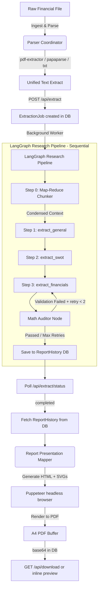

# 🏗️ Architecture & Core Pipeline

This document details the architectural layout, core pipeline, page-by-page fallback logic, and AI orchestration engines inside EquiGen.

---

## 🛰️ Core Pipeline Flow

The following diagram illustrates the ingestion, extraction, and rendering pipeline:

---

## 📄 Fallback-First Page Ingestion Pipeline

To handle mixed digital and scanned prospectuses, the PDF extractor uses a stateful, page-by-page pipeline:

1. **Native Ingestion (Fast & Free)**: Extracts text natively from each PDF page using `unpdf`.
2. **Threshold Criteria**: If a page yields **fewer than 100 characters**, the pipeline flags the page for image rendering.
3. **High-DPI Page Rendering**: Renders the target page to a PNG data URL using `@napi-rs/canvas`.
4. **Visual Inspection**: Scans the page for embedded graphics using `unpdf.extractImages`.
   - **Groq Vision Fallback**: If non-trivial graphics (width > 120px, height > 120px) are found, invokes `llama-3.2-11b-vision-preview` to interpret charts and tables visually.
   - **Tesseract OCR Fallback**: If no graphics are found, runs local `tesseract.js` OCR for scanned text at zero API cost.

---

## 🤖 AI Orchestration (LangChain & LangGraph)

### 🔌 The Role of LangChain
*   **Unified Model Switcher**: Provides a uniform interface over **Groq** (Llama 3.3 70B) and **OpenAI** (GPT-4o Mini) providers.
*   **Dynamic API Keys**: Users can input their own custom API keys in the settings panel. Keys are encrypted AES-256-GCM and stored in the database — they are NOT stored in plaintext anywhere server-side.
*   **Native Schema Enforcement**: Uses LangChain's `.withStructuredOutput(...)` API to enforce strict Zod schemas at the model-provider call level.

### 🕸️ The Role of LangGraph

LangGraph orchestrates a **sequential, stateful multi-step** research workflow with intermediate checkpointing to the database:

1. **Step 0 — Map-Reduce Preprocessor**: If raw text exceeds 25,000 characters, the document is split into overlapping chunks (12,000 chars with 1,200-char overlap). Each chunk is processed by `llama-3.1-8b-instant` to extract localized SWOT signals and financials. The results are merged into a high-density condensed context, reducing prompt sizes by ~90%.
2. **Step 1 — General Details Extraction**: `extract_general` extracts company name, ticker, industry overview, and business overview.
3. **Step 2 — SWOT & Thesis Extraction**: `extract_swot` extracts highlights, risks, investment thesis, and future growth drivers.
4. **Step 3 — Financials Extraction + Math Audit**: `extract_financials` extracts Revenue, EBITDA, PAT series plus current/target price and recommendation. A math auditor then validates (EBITDA ≤ Revenue, PAT ≤ EBITDA) and triggers a retry loop (max 1 retry) if inconsistencies are found.

Each step saves its output to the `ExtractionJob` record so that if a rate-limit interrupts mid-pipeline, the job can resume from the failed step instead of restarting from scratch.

### ⚖️ Model Router & Rate Limiter

*   **`model-router.ts`**: Before each extraction call, estimates the token size of the prompt. If it exceeds the primary model's TPM ceiling, automatically reroutes to the fallback model. Otherwise, waits for real budget headroom using the `TokenBudgetManager`.
*   **`TokenBudgetManager`**: Tracks actual token usage per model in a sliding 60-second window, preventing rate-limit collisions.
*   **`retry-wrapper.ts`**: On genuine 429 errors, parses Groq's `"try again in Xs"` hint and waits exactly that long before retrying once. If still rate-limited, throws a typed `RateLimitError` to signal `throttled` status in the DB.
