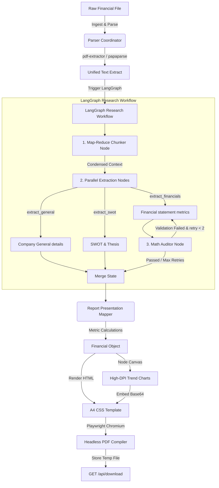

# ⚡ EquiGen — AI-Powered Equity Research Engine

[](https://nextjs.org/)
[](https://www.typescriptlang.org/)
[-orange?style=flat-square)](https://groq.com/)
[](https://playwright.dev/)

EquiGen is an enterprise-grade AI engine that automates the generation of publication-ready, Geojit-style equity research reports. By combining local document extraction, Groq Llama 3.3, server-side trend charting, and headless browser printing, EquiGen translates raw financial structures into institutional A4 PDFs instantly.

---

## 🚀 Key Features

*   **Multiformat Ingestion**: Instantly parse `.pdf`, `.csv`, and `.txt` files containing raw balance sheets, earnings call transcripts, or financial reports.
*   **Self-Correcting LLM Extraction**: Queries `llama-3.3-70b-versatile` over Groq with strict JSON schemas. If the model outputs invalid formats, a **3-step validation retry loop** feeds schemas and parsing errors back to the model to correct itself dynamically.
*   **High-DPI Financial Charting**: Automatically compiles server-side PNG graphics (Revenue Growth, EBITDA Margins, PAT Trends, and CAGR Benchmarks) scaled for A4 print safety using Node Canvas and Chart.js.
*   **Publication-Grade PDF Rendering**: Headless Playwright Chromium loads compiled HTML templates with inline styles, custom margins, dynamic header layouts, and footers with page numbering (`Page X of Y`).
*   **Fail-Safe Architecture**: If external chart compilation or headless modules encounter native issues, the engine falls back to text-only PDF layouts instead of crashing.

---

## 🛠️ Architecture & Core Pipeline



---

## 🤖 AI Orchestration (LangChain & LangGraph)

EquiGen leverages a modular, production-grade AI stack using **LangChain** and **LangGraph** to deliver robust multi-model support, context window optimization, and self-correcting financial audits.

### 🔌 The Role of LangChain
*   **Unified Model Switcher**: Provides a uniform interface abstraction over different model providers. Users can seamlessly switch between **Groq** (using Llama 3.3 70B) and **OpenAI** (using GPT-4o Mini or GPT-4o).
*   **Dynamic API Keys**: Allows users to input their own custom API keys in the settings panel. Keys are kept in browser-only `localStorage` for privacy and processed dynamically in runtime handlers.
*   **Native Schema Enforcement**: Uses LangChain's `.withStructuredOutput(...)` API to enforce strict TypeScript/Zod schemas directly at the model-provider call level, ensuring structured JSON responses.

### 🕸️ The Role of LangGraph
Large prospectus documents or annual reports (50+ pages) routinely trigger token limits or hallucinations. LangGraph orchestrates a stateful multi-agent research workflow to handle these edge cases:

1.  **Map-Reduce Preprocessor (`preprocess_chunks`)**:
    *   If raw text exceeds 25,000 characters, a token-splitting node segments the document into overlapping chunks.
    *   Chunks are processed concurrently (with concurrency limits to throttle API rate limits) to extract localized SWOT signals, revenues, and operational details.
    *   The node reduces and synthesizes these segments into a high-density, condensed context string, dropping prompt sizes by **90%**.
2.  **Parallel Extraction Nodes**:
    *   `extract_general`, `extract_swot`, and `extract_financials` run in parallel over the condensed context. This reduces cognitive load on the LLM and prevents mixed data schemas.
3.  **Math Auditor & Self-Correction Loop**:
    *   An audit node verifies the financial statement numbers (e.g. validating that EBITDA does not exceed Revenue, and PAT does not exceed EBITDA).
    *   If mathematical inconsistencies are detected, the auditor generates a list of correction instructions and **re-routes the graph back to the financials node** with the error warnings.
    *   To prevent infinite loops, the correction cycle is capped at a maximum of 2 retries.

---

## ⚡ Setup & Installation

### Prerequisites

Make sure you have Node 20+ and **pnpm** installed globally:

```bash
npm install -g pnpm
```

### Installation

1.  **Clone the workspace and install packages**:
    ```bash
    pnpm install
    ```
2.  **Approve native compilation scripts**:
    Pnpm blocks native postinstall scripts by default. Approve `canvas` script:
    ```bash
    pnpm rebuild canvas
    ```
3.  **Setup environment keys**:
    ```bash
    cp .env.example .env
    ```
    Add your `GROQ_API_KEY` inside `.env`.
4.  **Install Playwright browser binaries**:
    ```bash
    npx playwright install chromium
    ```

---

## 💻 Developer Workflow

### Run local development server
```bash
pnpm dev
```
Open [http://localhost:3000](http://localhost:3000) to view the interactive dashboard.

### Run production typescript build checks
```bash
npx tsc --noEmit
```

---

## 🐳 Docker Deployment

EquiGen comes packaged with a multi-stage production Dockerfile utilizing the official Playwright Jammy Ubuntu container. This container comes prebuilt with all required system libraries (Pango, Cairo, and browser dependencies) for node-canvas and Chromium.

### Using Docker Compose

1.  **Spin up the app container**:
    ```bash
    docker-compose up --build
    ```
2.  The application will be live at [http://localhost:3000](http://localhost:3000).

---

## 📄 License

Proprietary. Developed for EquiGen research systems. All rights reserved.
