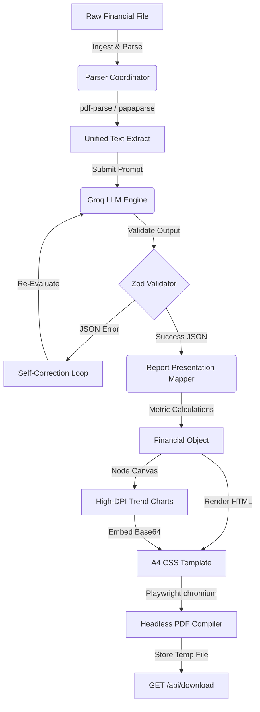

# ⚡ EquiGen — AI-Powered Equity Research Engine

[](https://nextjs.org/)
[](https://www.typescriptlang.org/)
[-orange?style=flat-square)](https://groq.com/)
[](https://playwright.dev/)

EquiGen is an enterprise-grade AI engine that automates the generation of publication-ready, Geojit-style equity research reports. By combining local document extraction, Groq Llama 3.3, server-side trend charting, and headless browser printing, EquiGen translates raw financial structures into institutional A4 PDFs instantly.

---

## 🚀 Key Features

*   **Multiformat Ingestion**: Instantly parse `.pdf`, `.csv`, and `.txt` files containing raw balance sheets, earnings call transcripts, or financial reports.
*   **Self-Correcting LLM Extraction**: Queries `llama-3.3-70b-versatile` over Groq with strict JSON schemas. If the model outputs invalid formats, a **3-step validation retry loop** feeds schemas and parsing errors back to the model to correct itself dynamically.
*   **High-DPI Financial Charting**: Automatically compiles server-side PNG graphics (Revenue Growth, EBITDA Margins, PAT Trends, and CAGR Benchmarks) scaled for A4 print safety using Node Canvas and Chart.js.
*   **Publication-Grade PDF Rendering**: Headless Playwright Chromium loads compiled HTML templates with inline styles, custom margins, dynamic header layouts, and footers with page numbering (`Page X of Y`).
*   **Fail-Safe Architecture**: If external chart compilation or headless modules encounter native issues, the engine falls back to text-only PDF layouts instead of crashing.

---

## 🛠️ Architecture & Core Pipeline



### Folder Structure

```
src/
  app/                  # Next.js App Router endpoints & page layouts
    api/
      upload/           # POST /api/upload - Accepts files, returns raw content structure
      extract/          # POST /api/extract - Passes strings to LLM self-correcting parser
      report/           # POST /api/report - Invokes chart canvas and Playwright PDF compilation
      download/         # GET /api/download?id=CMPY - Streams compiled report buffers
  components/           # Reusable UI React components (Dashboard, toasts, skeleton loaders)
  types/                # Domain TypeScript models
  lib/                  # Domain services and helpers
    ai/                 # Groq client integration, prompts, self-correction
    parsers/            # Raw extractors for PDF (ESM class-based), CSV, and TXT
    report/             # Presentation formatting, margin and financial ratio calculators
    charts/             # High-DPI Chart.js canvas renderers (PNG output)
    pdf/                # Headless Chromium printing engine
    templates/          # Geojit-style print-friendly A4 HTML report sheets
    validation/         # API validation Zod structures
```

---

## ⚡ Setup & Installation

### Prerequisites

Make sure you have Node 20+ and **pnpm** installed globally:

```bash
npm install -g pnpm
```

### Installation

1.  **Clone the workspace and install packages**:
    ```bash
    pnpm install
    ```
2.  **Approve native compilation scripts**:
    Pnpm blocks native postinstall scripts by default. Approve `canvas` script:
    ```bash
    pnpm rebuild canvas
    ```
3.  **Setup environment keys**:
    ```bash
    cp .env.example .env
    ```
    Add your `GROQ_API_KEY` inside `.env`.
4.  **Install Playwright browser binaries**:
    ```bash
    npx playwright install chromium
    ```

---

## 💻 Developer Workflow

### Run local development server
```bash
pnpm dev
```
Open [http://localhost:3000](http://localhost:3000) to view the interactive dashboard.

### Run production typescript build checks
```bash
npx tsc --noEmit
```

---

## 🐳 Docker Deployment

EquiGen comes packaged with a multi-stage production Dockerfile utilizing the official Playwright Jammy Ubuntu container. This container comes prebuilt with all required system libraries (Pango, Cairo, and browser dependencies) for node-canvas and Chromium.

### Using Docker Compose

1.  **Spin up the app container**:
    ```bash
    docker-compose up --build
    ```
2.  The application will be live at [http://localhost:3000](http://localhost:3000).

---

## 📄 License

Proprietary. Developed for EquiGen research systems. All rights reserved.
